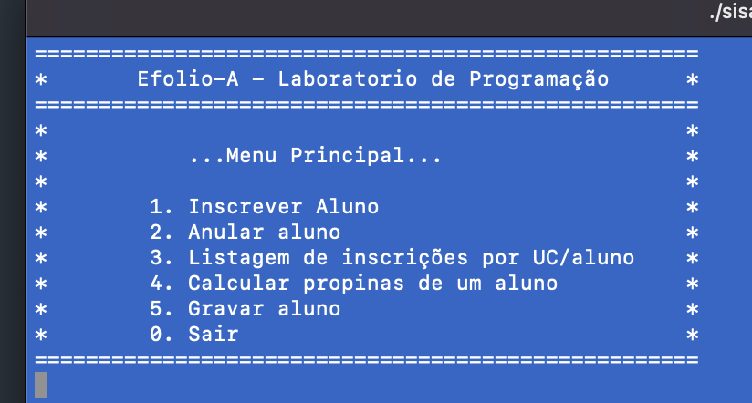

<h1 align="center">
    
</h1>

Trabalho em C
    
Programa CRUD em C, sobre cadastro de alunos, listagem e atualização e eliminação de dados

📌 CRUD em C 
------------------
O projeto foi feito em C.

The project was done with C.

🔧 Tecnologias utilizadas:
------------------

- C 

💬 Fale comigo
------------------
[*Entre em contato comigo*](https://www.linkedin.com/in/ivo-baptista-3712144/)

